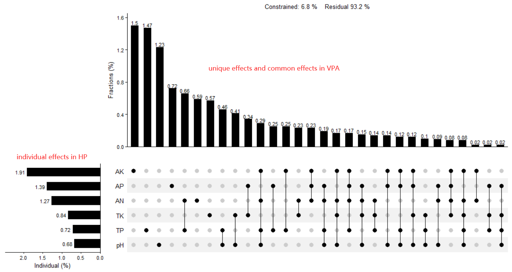
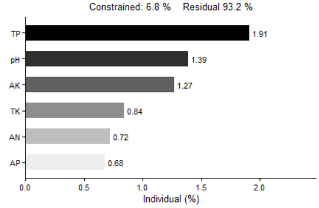
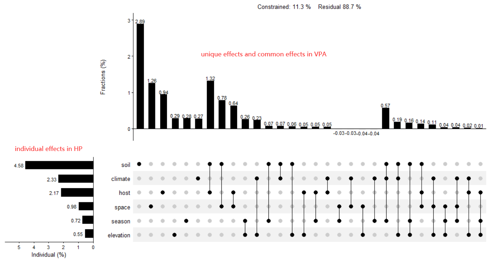
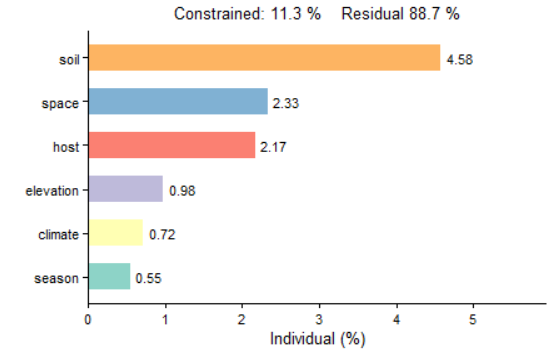

# UpSetVP

<!-- badges: start -->
<!-- badges: end -->

Visualization of variance partitioning analysis (VPA) and hierarchical partitioning (HP) with unlimited number of predictor variables (or matrices of predictors) using UpSet matrix layout ([刘尧 等人. 2023](https://www.plant-ecology.com/CN/10.17521/cjpe.2022.0314)).

## Installation

Install the released version of `UpSetVP` from [CRAN](https://cran.r-project.org/web/packages/UpSetVP/index.html) or [GitHub](https://github.com/LiuXYh/UpSetVP) with:

``` r
# from CRAN
install.packages('UpSetVP')

# or
# install.packages('devtools')
devtools::install_github('LiuXYh/UpSetVP', force = TRUE)
```

## A Simple Example

Load packages.

``` r
library(rdacca.hp)
library(ggplot2)
library(patchwork)
library(UpSetVP)
```

Ectomycorrhizal (EcM) fungal community and environmental data were excerpted from [Gong et al. (2022)](https://www.ncbi.nlm.nih.gov/pmc/articles/PMC8754124/).

``` r
data(baima.fun)
data(baima.env)
```

Quantify the relative importance of individual soil properties (pH, TP, TK, AN, AP, AK) on the composition of EcM fungal community by using partial dbRDA.

``` r
# Bray-Curtis index was used to calculate community composition dissimilarity
baima.fun.bray <- vegdist(baima.fun, method = 'bray')

# VPA and HP by using rdacca.hp package (Lai et al. 2022)
soil <- baima.env[c('pH', 'TP', 'TK', 'AN', 'AP', 'AK')]
baima.soil.vp <- rdacca.hp(baima.fun.bray, soil, method = 'dbRDA', var.part = TRUE, type = 'adjR2')

# Plot unique, common, as well as individual effects
upset_vp(baima.soil.vp, plot.hp = TRUE)
```



``` r
# Only plot individual effects
barplot_hp(baima.soil.vp, col.fill = 'var')
```



##
The relative importance of groups of environmental factors on EcM fungal community composition.<br>
Environmental factors including elevation, season, space (dbMEM1 and dbMEM2), host (em.GR and em.abun), climate (sea.MT), and soil (pH, TP, TK, AN, AP, and AK).

``` r
# Distance-based Moran's eigenvector maps (dbMEM) was used to extract spatial relationships
space.dbmem <- adespatial::dbmem(baima.env[c('latitude', 'lontitude')])

# VPA and HP by using rdacca.hp package
env.list <- list(
    elevation = baima.env['altitude'],
    season = baima.env['season'],
    space = data.frame(space.dbmem)[1:2],
    host = baima.env[c('em.GR', 'em.abun')],
    climate = baima.env['sea.MT'],
    soil = baima.env[c('pH', 'TP', 'TK', 'AN', 'AP', 'AK')]
)
baima.env.vp <- rdacca.hp(baima.fun.bray, env.list, method = 'dbRDA', var.part = TRUE, type = 'adjR2')

# Plot unique, common, as well as individual effects
upset_vp(baima.env.vp, plot.hp = TRUE, order.part = 'degree')
```



``` r
# Only plot individual effects
barplot_hp(baima.env.vp, col.fill = 'var', col.color = c('#8DD3C7', '#FFFFB3', '#BEBADA', '#FB8072', '#80B1D3', '#FDB462', '#B3DE69'))
```



## References

[刘尧,于馨,于洋,胡文浩,赖江山. rdacca.hp包在生态学数据分析中的应用: 案例与进展. 植物生态学报，2023, 27:134-144.](https://www.plant-ecology.com/CN/10.17521/cjpe.2022.0314)<br>
[Gong S, Feng B, Jian S P, et al. Elevation Matters More than Season in Shaping the Heterogeneity of Soil and Root Associated Ectomycorrhizal Fungal Community. Microbiology spectrum, 2022, 10(1): e01950-21.](https://www.ncbi.nlm.nih.gov/pmc/articles/PMC8754124/)<br>
[Lai J, Zou Y, Zhang J, et al. Generalizing hierarchical and variation partitioning in multiple regression and canonical analyses using the rdacca. hp R package. Methods in Ecology and Evolution, 2022, 13(4): 782-788.](https://besjournals.onlinelibrary.wiley.com/doi/full/10.1111/2041-210X.13800)<br>
