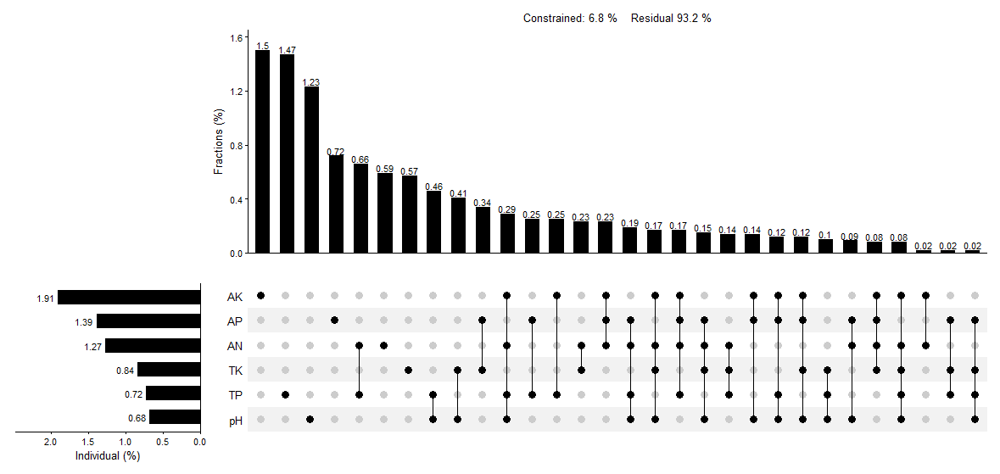
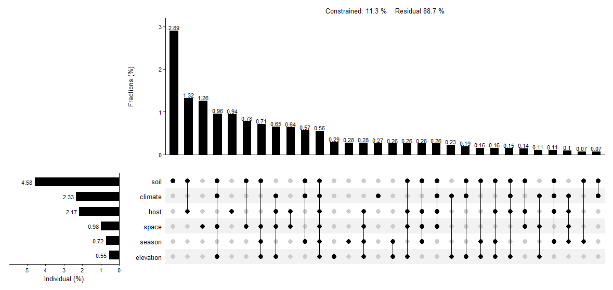

# UpSetVP

<!-- badges: start -->
<!-- badges: end -->

Visualization of variance decomposition analysis (VPA) and hierarchical partitioning (HP) with unlimited number of predictor variables (or matrices of predictors) using UpSet matrix layout.

## Installation

Install the released version of `UpSetVP` from
[GitHub](https://github.com/LiuXYh/UpSetVP) with:

``` r
# install.packages('devtools')
devtools::install_github('LiuXYh/UpSetVP')
```

## A Simple Example

Load packages.

``` r
library(rdacca.hp)
library(ggplot2)
library(patchwork)
library(UpSetVP)
```

Ectomycorrhizal (EcM) fungal community and environmental data were excerpted from Gong et al. (2022).

``` r
data(baima.fun)
data(baima.env)
```

Quantify the relative importance of individual soil properties (pH, TP, TK, AN, AP, AK) on the composition of EcM fungal community by using partial dbRDA.

``` r
# Bray-Curtis index was used to calculate community composition dissimilarity
baima.fun.bray <- vegdist(baima.fun, method = 'bray')

# VPA and HP by using rdacca.hp package
soil <- baima.env[c('pH', 'TP', 'TK', 'AN', 'AP', 'AK')]
baima.soil.vp <- rdacca.hp(baima.fun.bray, soil, method = 'dbRDA', var.part = TRUE, type = 'adjR2')

# Plot
upset.vp(baima.soil.vp)
```



The relative importance of groups of environmental factors on EcM fungal community composition.
Environmental factors including elevation, season, space (dbMEM1 and dbMEM2), host (em.GR and em.abun), climate (sea.MT), and soil (pH, TP, TK, AN, AP, and AK).

``` r
# Distance-based Moran's eigenvector maps (dbMEM) was used to extract spatial relationships
space.dbmem <- adespatial::dbmem(baima.env[c('latitude', 'lontitude')])

# VPA and HP by using rdacca.hp package
env.list <- list(
    elevation = baima.env['altitude'],
    season = baima.env['season'],
    space = data.frame(space.dbmem)[1:2],
    host = baima.env[c('em.GR', 'em.abun')],
    climate = baima.env['sea.MT'],
    soil = baima.env[c('pH', 'TP', 'TK', 'AN', 'AP', 'AK')]
)
baima.env.vp <- rdacca.hp(baima.fun.bray, env.list, method = 'dbRDA', var.part = TRUE, type = 'adjR2')

# Plot
upset.vp(baima.env.vp)
```



## References

Gong S, Feng B, Jian S P, et al. Elevation Matters More than Season in Shaping the Heterogeneity of Soil and Root Associated Ectomycorrhizal Fungal Community. Microbiology spectrum, 2022, 10(1): e01950-21.
